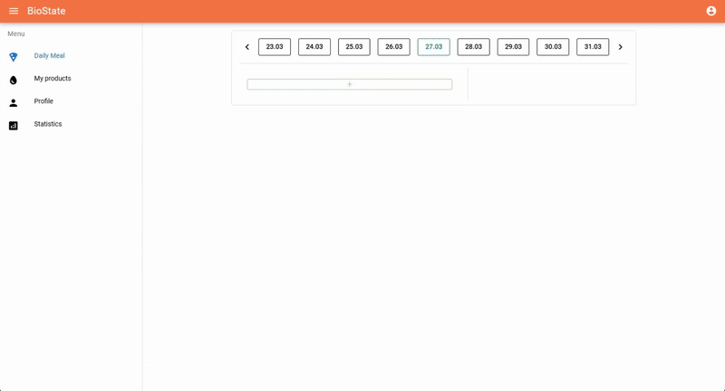

# BioState Backend

This repository contains the backend API on Laravel for the BioState application.

BioState is a comprehensive application designed to help you monitor and manage various aspects of your well-being. Currently, it allows you to record your dietary intake, track calories, proteins, fats, and carbohydrates, view insightful statistics, and set personalized limits for these macronutrients. You can also define custom products to easily log your daily meals. While the current focus is on nutrition, BioState is envisioned as a holistic bio-monitoring tool with future capabilities to include tracking sleep and exercise.

## Features

-   **Recording food ration:** Log what you eat on a daily basis.
-   **Macronutrient tracking:** Monitor your intake of proteins, fats, and carbohydrates.
-   **Calorie tracking:** Automatically count the total calories of your meals.
-   **Statistics:** View insightful data and trends related to your nutrition.
-   **Custom limits:** Set personalized daily limits for calories and macronutrients.
-   **Product management:** Define custom food products with their nutritional information for quick logging.

## Installation (dev mode)

> **Note:** For now this backend is designed to work in conjunction with the **[BioState frontend](https://github.com/lewenbraun/biostate-frontend)**. Both repositories should be cloned into the same parent directory for the Docker Compose setup to function correctly.

Follow these steps to get the BioState backend running on your local machine using Docker.

1.  **Create a folder**

    ```bash
    mkdir biostate
    cd biostate
    ```

2.  **Clone the Repository**

    ```bash
    git clone https://github.com/lewenbraun/biostate-backend.git
    ```

3.  **Clone the Frontend Repository**

    Navigate to the parent directory where you cloned the backend repository and clone the frontend repository:

    ```bash
    git clone https://github.com/lewenbraun/biostate-frontend.git
    ```

    Your directory structure should now look like this:

    ```
    biostate/
    ├── biostate-backend/
    └── biostate-frontend/
    ```

4.  **Configure Environment**

    - Copy of the sample environment file in the **backend** and **frontend** part:

        ```bash
        cp .env.example .env
        ```

    -   Update your `.env` file if necessary (locally everything should work without changes in the copied .env).

5.  **Start Docker Containers**

    Launch the application using Docker Compose from the `biostate-backend` directory:

    ```bash
    docker compose up -d
    ```

6.  **Generate Application Key**

    Generate the Laravel application key:

    ```bash
    docker compose exec bs-backend php artisan key:generate
    ```

7.  **Run Migrations**

    Initialize the database schema with:

    ```bash
    docker compose exec bs-backend php artisan migrate
    ```

8.  **Run product seeder (optionally)**

    Create base products for the test:

    ```bash
    docker compose exec bs-backend php artisan db:seed --class=ProductSeeder
    ```

## Usage

Here's a quick glimpse of how the application works:



## Contributing

Contributions, issues, and feature requests are welcome. Please check the issues page for more details.

## License

This project is licensed under the MIT License.
